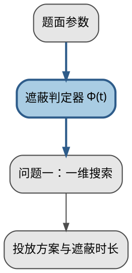
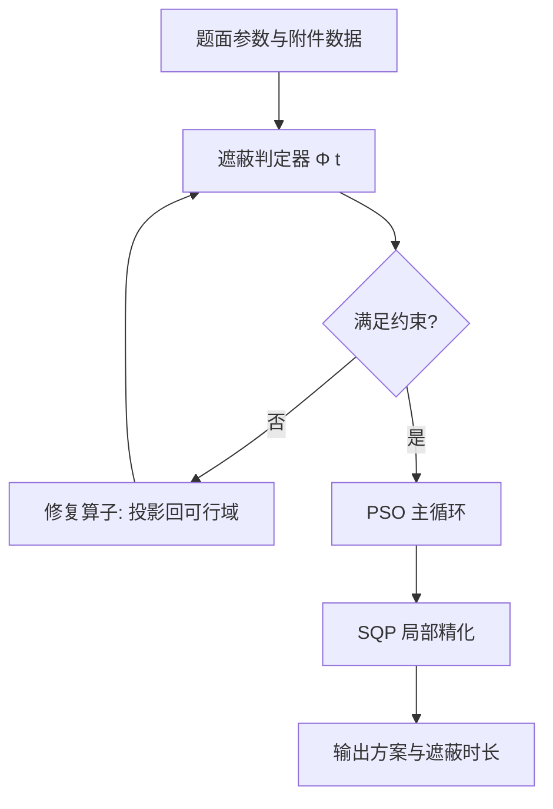

# 示意图与流程图规范（国赛）

> 本文件是 `cumcm-table-figure` 的示意图参考，覆盖**一切不是用数据点画出来的图**：
> 模型框架图、求解流程图、算法框图、机理示意图。数据图（折线/散点/热力/龙卷风/收敛曲线）归 `cumcm-figure`。
> 所有 TikZ 代码在 `templates/cumcm-thesis/`（ctex + `\usepackage{tikz}`，XeLaTeX）下可用。

内容：三类与选用 → 连线语义 → TikZ 基线配置 → 三个完整模板（框架图 / 流程图 / 机理图）→
备选路线 → 字号 → 常见故障 → Mermaid 协作 → 检查清单。

## 1. 三类示意图与选用

| 类型 | 回答的问题 | 结构 | 放在论文哪里 | 典型题 |
|---|---|---|---|---|
| **模型框架图** | "整篇论文怎么组织？" | 输入层 → 处理层 → 输出层，可带并列分支 | 二、问题分析（必须有 1 张） | 全部题型 |
| **求解流程图** | "算法一步步怎么走？" | 顺序 + 分支 + 回环 | 五、模型建立与求解（每问 0～1 张） | A/B 题优化与仿真 |
| **机理示意图** | "物理过程长什么样？" | 几何/受力/坐标/时序 | 五、模型建立（推导之前） | A 题传热、B 题定位 |
| **算法框图** | "模块之间怎么调用？" | 模块 + 调用箭头（无分支） | 五、求解算法小节；伪代码的图形版 | 多算法串联 |

选用规则：图里有**分支判断** → 流程图（菱形判断框）；只有**层次与并列** → 框架图；
要画**真实几何对象**（圆柱、视线、坐标轴、力） → 机理图。
**不要用框架图讲算法细节，也不要用流程图代替框架图**——前者看不到全貌，后者看不到分支。

顺序纪律：先写"模块清单 + 每个模块一句话"，再画箭头，最后才调坐标；一上手就摆方框，最后一定得到"连线交叉、读不出主路径"的图。

## 2. 模块与连线语义约定

| 元素 | 语义 | 画法 | 例子 |
|---|---|---|---|
| 实线粗框 | 本文方法 / 主路径 | `very thick` + 信号家族色 | 混合整数模型 |
| 实线细框 | 对照 / 外围模块 | `thick` + 中性色 | 线性松弛、数据预处理 |
| 虚线框 | 假设、简化、可选步骤 | `dashed` | "不考虑风切变" |
| 圆角框 | 处理步骤 | `rounded corners` | 遮蔽判定 |
| 直角框 | 数据 / 输入输出 | 无圆角 | 附件数据、结果表 |
| 菱形 | 判断（有且仅有 2 个出口） | `diamond` | 收敛？可行？ |
| 实线箭头 | **数据流**（A 产生 B） | `-{Stealth}` | 参数 → 判定器 |
| 虚线箭头 | **控制流**（调用、回环、早停） | `dashed` + `-{Stealth}` | 收敛判据 → 提前终止 |
| 粗实线箭头 | 主路径（hero path） | `line width=1.2pt` | 本文选定路线 |
| 无箭头连线 | 并列 / 归属 | 只有线 | 三个子问题并列成一层 |
| 双向箭头 | 迭代耦合 | `{Stealth}-{Stealth}` | 参数估计 ↔ 状态更新 |

三条硬纪律：① **一条连线必须能读成一句话**（"这个箭头是干嘛的"读不出来就删）；
② **同一语义全篇只用一种画法**（本文方法在图 1 是粗线，在图 3 也得是粗线）；
③ **判断框的每个出口都要标"是"/"否"**，无标注的分支等于没画。

## 3. TikZ 基线配置与配色

导言区（`example.tex` 已 `\usepackage{tikz}`，再补库、配色与样式）：

```latex
% ---- 1) 需要的 TikZ 库 ----
\usetikzlibrary{positioning, arrows.meta, shapes.geometric, calc, fit, backgrounds}

% ---- 2) 配色：与 cumcm-figure/scripts/cumcm_style.py 的 PALETTE 逐位对齐 ----
\definecolor{cmNeutralDark}{HTML}{4D4D4D}   % PALETTE.neutral[0] 中性·深
\definecolor{cmNeutralMid}{HTML}{8C8C8C}    % PALETTE.neutral[1] 中性·中
\definecolor{cmNeutralLight}{HTML}{E6E6E6}  % PALETTE.neutral[3] 中性·浅（填充）
\definecolor{cmSignal}{HTML}{2E5C8A}        % PALETTE.signal[0]  信号·主（本文方法）
\definecolor{cmSignalLight}{HTML}{A9CCE3}   % PALETTE.signal[3]  信号·浅（填充）
\definecolor{cmAccent}{HTML}{C0392B}        % PALETTE.accent[0]  强调·关键点/最优

% ---- 3) 统一样式：全篇示意图共用，避免每张图各写一套 ----
\tikzset{
  blk/.style   = {rectangle, rounded corners=2pt, draw=cmNeutralDark, thick,
                  fill=cmNeutralLight, text width=28mm, align=center,
                  minimum height=7mm, inner sep=3pt, font=\small},
  hero/.style  = {blk, draw=cmSignal, very thick, fill=cmSignalLight, text width=44mm},
  io/.style    = {blk, fill=white, rounded corners=0pt},
  ghost/.style = {blk, draw=cmNeutralMid, dashed, fill=white},
  dec/.style   = {diamond, draw=cmNeutralDark, thick, fill=white,
                  minimum width=34mm, minimum height=12mm,      % 菱形内切矩形只有一半，
                  align=center, font=\small, inner sep=1pt},    % 尺寸必须给足，字才不会压边
  ar/.style    = {-{Stealth[length=2mm]}, thick, draw=cmNeutralDark},
  ctrl/.style  = {-{Stealth[length=2mm]}, thick, dashed, draw=cmAccent},
}
```

配色纪律：中性家族画背景/基线/对照，信号家族画本文方法，**强调家族只画关键点（最优值、失效边界）**，
一张图里强调色出现不超过 3 次；灰度打印仍要能区分，所以**颜色之外必须有第二通道**（线型、粗细、填充与否）；
不要用纯红/纯绿对举。

## 4. TikZ 完整模板一：模型框架图

```latex
\begin{figure}[htbp]
  \centering
  \begin{tikzpicture}

    % ---------- 输入层（y = 0）----------
    \node[io] (param) at (-4.8,0) {题面参数\\坐标 / 速度 / 延时 / 烟幕尺寸};
    \node[io] (data)  at ( 0.0,0) {附件数据\\逐小时监测记录};
    \node[io] (assum) at ( 4.8,0) {假设与简化\\圆柱形烟幕 / 匀速下沉};

    % ---------- 判定层：四问共用内核（y = -2.4）----------
    \node[hero] (judge) at (0,-2.4)
      {遮蔽判定器 $\Phi(t)=\mathbf{1}[\,d(t)\le w(t)\,]$\\[1pt]
       \footnotesize（几何判据 + 平行六面体法交叉验证）};

    % ---------- 求解层：四问并列（y = -5.0）----------
    \node[blk] (q1) at (-5.4,-5.0) {问题一\\一维精细搜索};
    \node[blk] (q2) at (-1.8,-5.0) {问题二\\六维粒子群};
    \node[blk] (q3) at ( 1.8,-5.0) {问题三\\PSO + SQP};
    \node[blk] (q4) at ( 5.4,-5.0) {问题四\\滚动时域重规划};

    % ---------- 输出层（y = -7.2）----------
    \node[io, text width=108mm] (out) at (0,-7.2)
      {投放点 / 投放时刻 / 起爆点 / 有效遮蔽时长\\[1pt]
       $\rightarrow$ 约束余量核对 $\rightarrow$ 灵敏度分析 $\rightarrow$ 结论与建议};

    % ---------- 连线 ----------
    \draw[ar] (param.south) -- ++(0,-0.6) -| (judge.north);
    \draw[ar] (data.south)  -- (judge.north);
    \draw[ar] (assum.south) -- ++(0,-0.6) -| (judge.north);

    \foreach \q in {q1,q2,q3,q4}{
      \draw[ar] (judge.south) -- ++(0,-0.9) -| (\q.north);
      \draw[ar] (\q.south) -- ++(0,-0.6) -| (out.north);
    }

    % ---------- 独立复核：由判定器调用的控制流（虚线）----------
    \node[ghost] (verify) at (5.4,-2.4) {独立复核\\平行六面体体积法};
    \draw[ctrl] (judge.east) -- node[above, font=\footnotesize, text=cmAccent]{交叉验证}
      (verify.west);

  \end{tikzpicture}
  \caption{本文整体建模框架：判定层为四问共用的核心，问题一至四的差别仅在决策变量
           维数与求解算法（对应正文第二、五节）}
  \label{fig:framework}
\end{figure}
```

**要点**：图中每一层对应论文的一个章节（评委看图就能跳到对应页）；"判定层"画成被四条支路共享的横条，
直接可视化了"一次建模、四问复用"；右上的"独立复核"用**虚线**连出，表示它是判定器调用的一次控制流，
而不是数据流。**图下方必须有一段解读文字**（"由图 1 可见，判定层是四问共用内核……"）。

## 5. TikZ 完整模板二：算法流程图

```latex
\begin{figure}[htbp]
  \centering
  \begin{tikzpicture}

    \node[io]  (start)  at (0, 0.0) {开始};
    \node[blk] (init)   at (0,-1.3) {读入题面参数\\初始化粒子群 $N=60$};
    \node[blk] (fit)    at (0,-2.8) {计算适应度：\\离散时间轴求并集时长 $T$};
    \node[blk] (repair) at (0,-4.3) {约束修复\\越界分量投影回可行域};
    \node[dec] (conv)   at (0,-6.1) {收敛？};
    \node[right=1mm of conv, font=\footnotesize, text width=36mm, align=left]
      {改进量 $<10^{-4}$ s\\且连续 40 代};
    \node[blk] (upd)    at (-4.6,-4.3) {更新速度与位置\\$k \leftarrow k+1$};
    \node[blk] (refine) at (0,-7.9) {以 gbest 为初值\\SQP 局部精化};
    \node[io]  (out)    at (0,-9.3) {输出 $t^*$、$T^*$ 与约束余量表};
    \node[io]  (stop)   at (0,-10.6) {结束};

    \draw[ar] (start)  -- (init);
    \draw[ar] (init)   -- (fit);
    \draw[ar] (fit)    -- (repair);
    \draw[ar] (repair) -- (conv.north);
    \draw[ar] (conv.south) -- node[right, font=\footnotesize]{是} (refine.north);
    \draw[ar] (refine) -- (out);
    \draw[ar] (out)    -- (stop);

    % 回环：虚线 = 控制流
    \draw[ctrl] (conv.west) -- node[above, font=\footnotesize, text=cmAccent]{否} (upd.east);
    \draw[ctrl] (upd.north) |- (fit.west);

  \end{tikzpicture}
  \caption{遮蔽时长最大化粒子群算法的求解流程（参数设置与正文求解算法小节一致）}
  \label{fig:flow-pso}
\end{figure}
```

**要点**：① 回环用**虚线**，一眼区分"往下走的主流程"与"往上跳的迭代"；② 判断框只有两个出口，
都标了"是/否"；③ 图里的 $N=60$、收敛判据与伪代码/正文参数设置**逐字一致**；
④ **菱形里的字不超过 4 个**（菱形内切矩形只有外框的一半，字一多就压边），
完整的判断条件写成菱形右侧的小字注释——上面就是这么处理的。

## 6. TikZ 完整模板三：机理/坐标系示意图

以"视线—烟幕云团相交判据"为例（侧视图，$x$–$z$ 平面）：

```latex
\begin{figure}[htbp]
  \centering
  \begin{tikzpicture}[font=\small]

    % ---------- 坐标系 ----------
    \draw[->, cmNeutralDark] (0,0) -- (6.6,0) node[right]{$x$ (m)};
    \draw[->, cmNeutralDark] (0,0) -- (0,4.2) node[above]{$z$ (m)};

    % ---------- 目标（坐标原点）----------
    \fill[cmAccent] (0,0) circle (1.6pt);
    \node[below right, font=\footnotesize, text=cmAccent] at (0.05,-0.05) {目标 $O$};

    % ---------- 烟幕云团（竖直圆柱，半径 R、高 H）----------
    \draw[cmSignal, thick] (2.7,0.8) -- (2.7,2.4);
    \draw[cmSignal, thick] (3.3,0.8) -- (3.3,2.4);
    \draw[cmSignal, thick] (3.0,2.4) ellipse (0.3 and 0.08);
    \draw[cmSignal, dashed] (3.0,0.8) ellipse (0.3 and 0.08);   % 隐藏轮廓用虚线
    \draw[cmSignal, dashed] (3.0,0.8) -- (3.0,2.4);             % 中心轴
    \node[right, font=\footnotesize, text=cmSignal] at (3.42,2.15) {云团 $R=10$ m};
    \draw[cmSignal, -{Stealth[length=2mm]}] (2.55,3.0) -- (2.55,2.45);
    \node[right, font=\footnotesize, text=cmSignal] at (2.6,3.02) {$v_s$};

    % ---------- 视线：制导武器 M → 目标 O ----------
    \draw[cmAccent, thick] (6.0,3.0) -- (0,0);
    \fill[cmAccent] (6.0,3.0) circle (1.6pt);
    \node[above left, font=\footnotesize, text=cmAccent] at (6.0,3.0) {制导武器 $M(t)$};

    % ---------- 视线到柱轴的距离 d(t)：从轴点作垂线 ----------
    \draw[cmNeutralDark, densely dotted] (3.0,1.2) -- (2.88,1.44);
    \node[right, font=\footnotesize] at (2.70,1.24) {$d(t)$};

    % ---------- 视线俯仰角 alpha ----------
    \draw[cmNeutralDark] (1.3,0) arc [start angle=0, end angle=26.6, radius=1.3];
    \node[font=\footnotesize] at (1.55,0.22) {$\alpha(t)$};

    % ---------- 云团直径标注 ----------
    \draw[cmNeutralMid, <->] (2.7,0.45) -- (3.3,0.45);
    \node[below, font=\footnotesize, text=cmNeutralDark] at (3.0,0.42) {$2R$};

  \end{tikzpicture}
  \caption{视线—烟幕云团相交判据的几何示意：当视线到柱轴的距离 $d(t)$ 不超过云团在
           视线方向上的投影半宽 $w(t)=R/\cos\alpha(t)$ 时判定为遮蔽}
  \label{fig:geometry}
\end{figure}
```

**要点**：① 隐藏轮廓用虚线（底圆、中心轴），可见轮廓用实线；② 尺寸标注全部在图形**外部**，不压线；
③ 坐标轴带量名与单位 `$x$ (m)`；④ 图里出现的每个符号（$d,w,\alpha,v_s,R$）都必须在正文符号表里有定义。

## 7. 备选路线：Graphviz / matplotlib

| 路线 | 适用 | 优点 | 代价 |
|---|---|---|---|
| **TikZ（首选）** | 最终稿、一切示意图 | 矢量、字体与正文完全一致、可 `\ref` 交叉引用 | 坐标要手调 |
| **Graphviz `dot`** | 节点多（>12）的依赖图/调用图 | 自动排布，不漏节点 | 中文要指定 `fontname`；样式粗糙，与正文不统一 |
| **matplotlib** | 示意图与数据面板要拼在一张图里 | 与 `cumcm-figure` 共用 `apply_cumcm_style()` 与 `PALETTE` | 框图要手写 `FancyBboxPatch`，不如 TikZ 精确 |
| **Mermaid** | 讨论阶段的草图 | 改起来最快 | **不进论文**（字体/换行不可控） |

**Graphviz 路线**（先确认 `dot -V` 可用；本仓库当前机器未安装）：



编译并插图：`dot -Tpdf -o figures\framework.pdf framework.dot`，再 `\includegraphics`。
三条注意：① `fontname` 必须是本机真实存在的中文字体，否则输出方框；② 输出 PDF 后要检查字体是否嵌入
（`pdffonts framework.pdf` 每行都应有 `yes`）；③ dot 的默认灰底方框与论文风格不符，
插进论文前先统一改 `fillcolor/color/penwidth`。

**matplotlib 路线**（与数据图共用风格层）：

```python
import sys; sys.path.insert(0, r"skills/cumcm-figure/scripts")
from cumcm_style import apply_cumcm_style, save_cumcm_figure, PALETTE, CM
import matplotlib.pyplot as plt
from matplotlib.patches import FancyBboxPatch, FancyArrowPatch

apply_cumcm_style()
fig, ax = plt.subplots(figsize=(CM.double_column, 6 * CM.cm))
ax.set_axis_off(); ax.set_xlim(0, 10); ax.set_ylim(0, 6)

def box(x, y, w, h, text, fc, ec):          # 方框 + 居中文字
    ax.add_patch(FancyBboxPatch((x, y), w, h, boxstyle="round,pad=0.05", fc=fc, ec=ec, lw=1.2))
    ax.text(x + w/2, y + h/2, text, ha="center", va="center", fontsize=9)

box(0.4, 4.6, 3.0, 0.9, "题面参数与附件数据", "#FFFFFF", PALETTE["neutral"][0])
box(3.6, 2.6, 3.0, 0.9, "遮蔽判定器 Φ(t)", PALETTE["signal"][3], PALETTE["signal"][0])
ax.add_patch(FancyArrowPatch((1.9, 4.6), (5.1, 3.5), arrowstyle="-|>",
                             mutation_scale=10, color=PALETTE["neutral"][0]))
save_cumcm_figure(fig, "figures/fig_framework")   # 同时出 PDF + 600dpi PNG
```

## 8. 字号与最小尺寸

**国赛正文 12pt（小四）时的换算表**：

| 命令 | 大约字号 | 占正文比 | 示意图里能不能用 |
|---|---|---|---|
| `\normalsize` | 12 pt | 100% | 能（模块名，通常不必这么大） |
| `\small` | 11 pt | ~92% | **推荐默认** |
| `\footnotesize` | 10 pt | ~83% | 能用（边注、坐标刻度说明） |
| `\scriptsize` | 8 pt | ~67% | **禁止**（低于 80% 下限） |
| `\tiny` | 6 pt | 50% | **禁止** |

纪律：① 每个 `tikzpicture` 显式写 `font=\small`（或 `[font=\small]`），不要靠默认；
② 需要更小时用 `\footnotesize`，到此为止；③ **不要用 `scale=0.6` 或 `\resizebox` 缩小整图**
（文字一起缩小，等于把 11pt 变成 7pt）；④ 图太大就调布局（`node distance`、`text width`、拆成两张），而不是缩字。

尺寸口径（与 `cumcm-figure` 一致）：单栏 ≈ 8cm（`CM.single_column`），通栏 ≈ 16cm（`CM.double_column`），
示意图通常用通栏；超出 `\linewidth` 时 LaTeX 会报 `Overfull \hbox`——**看到这个警告就必须改图**。

## 9. 常见故障与修法

| 故障 | 症状 | 修法 |
|---|---|---|
| **箭头交叉** | 连线互相穿过，读不出路径 | ① 首选重排：把目标节点移到源节点下方/侧下方；② 走正交折线：先 `(a.south) -- ++(0,-0.8)`，再用 `-|` 或 `|-` 连到 `(b.north)`；③ 必须交叉时用**断口法**：先画线，再在交叉点覆盖白色短线 `\draw[white, line width=2.5pt] (3.0,2.0) -- (3.0,2.4);` |
| **文字溢出方框** | 中文跑到框外或压住边框 | 只写 `text width=28mm, align=center`（`minimum width` 只改形状**不**改换行）；框太小先减字，再放宽 `text width` |
| **中文变方框/乱码** | 图内中文显示为 □ | 必须用 **XeLaTeX** 编译；不要在节点里混用 `\CJKfamily` 与 `font=\rmfamily`；Graphviz/matplotlib 路线要单独指定中文字体 |
| **图太宽超页边** | `Overfull \hbox (xx.xpt too wide)` | 缩小 `node distance`、横排改两行、`text width` 改窄；通栏图上限 16cm；**不要** `\resizebox` |
| **连线贴在框上** | 箭头尖端插进方框 | 用 `shorten >=1pt` 或 `outer sep=2pt`；箭头指向用 `(a) -- (b.north)` 指定锚点 |
| **框大小不一** | 同一层的框高矮不齐 | 统一 `minimum height=7mm` + 固定 `text width`；或用 `fit` 节点统一 |
| **字体与正文不一致** | 图内是 sans，正文是 serif | 不要在 TikZ 里写 `\sffamily`；直接用文档默认字体（ctex 下即中文正文体） |
| **灰度打印后分不清** | 彩打正常，黑白一片 | 颜色之外加线型/粗细/填充差异；检查 `bwprint` 选项下的效果 |

## 10. Mermaid 草图 → TikZ 定稿

讨论阶段用 Mermaid 快速改结构（谁指向谁），定稿阶段翻译成 TikZ：



翻译纪律：① **Mermaid 只进讨论记录，不进论文**——它的字体、换行、节点尺寸都不可控，
导出 SVG 后与正文风格明显不一致，评委会看出"两张图不是一个人做的"；
② 翻译时保持节点语义不变，只重排坐标与样式；③ `-->`（数据流）对应 `ar` 样式，
`-.->`（控制流）对应 `ctrl` 样式，这个映射一次定好，避免同一箭头在两种图里语义不同；
④ 定稿后把 Mermaid 源移进 `sop/project/` 草稿区，不要留在论文目录里。

## 11. 交付前检查清单

- [ ] 编号、`\label`、正文 `\ref`/`\cref` 对得上，且正文在**图之前**引用
- [ ] 图题在**下方**，一句话说清"这张图讲什么"；图后有 2～4 句**解读文字**（不是重复图题）
- [ ] 阅读方向唯一（左→右 或 上→下），主路径一眼可见
- [ ] 每个模块名是"动词+宾语"，没有"模块1/处理/其他"
- [ ] 每条连线都能读成一句话；判断框出口都标了"是/否"
- [ ] 线型语义全篇统一（实线=数据流，虚线=控制流）；配色取自 `PALETTE` 三家族，灰度可区分
- [ ] 图内字号 ≥ 正文 80%（`\small`/`\footnotesize`），**没有** `scale=`/`\resizebox` 缩字
- [ ] 宽度在 `\linewidth` 内，编译无 `Overfull \hbox` 警告
- [ ] 图内符号与正文符号表一致；图里的数字与表格/摘要逐位一致
- [ ] 图内无校名、姓名、学号、赛区信息
- [ ] 编译后**实际打开 PDF 看过**：中文正常、箭头不交叉、无文字溢出
